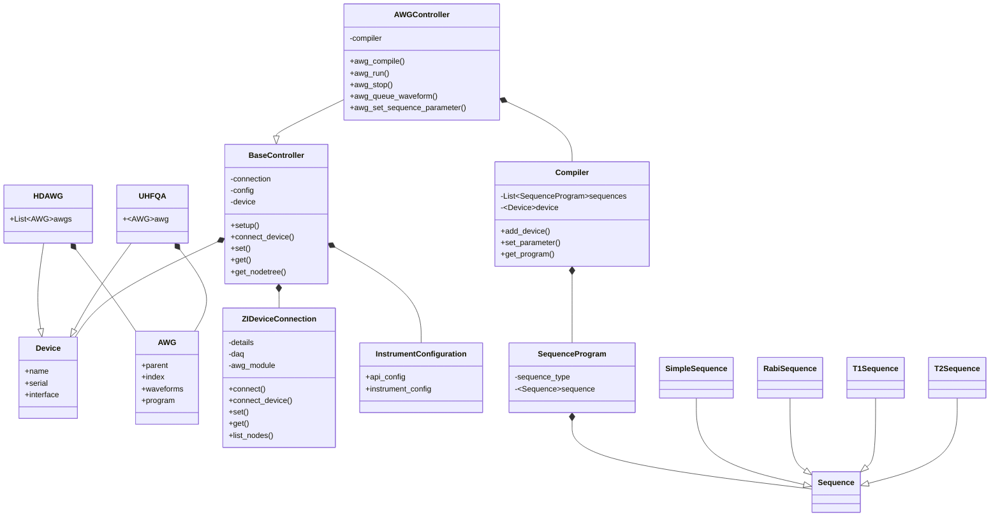

# zi-driver

See examples for more ...

use pip install:
```
pip install -e zi-drivers
```


### `example_multi_device.py`

Control two devices at once, HDAWG and UHFQA. Sequence on HD in "Send Trigger" mode and on QA in "External Trigger". Play Rabi sequence on with readout from QA.

### `example_Rabi-T1-T2.py`:

Loops over Rabi, T1 and T2* sequence.


### `example_waveform_upload.py`:

In "Simple" mode: queue waveforms and upload them all at once.


# Class Diagram





