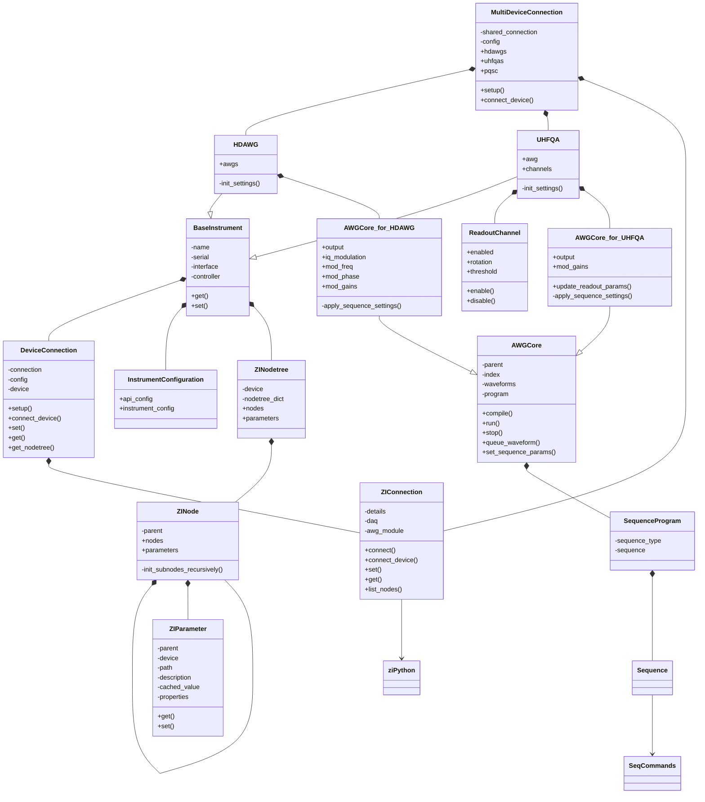

# Class Diagram

    
    
    
    
    
    AWGCore .. ZIConnection
    
    

    
    
   
    
    MultiDeviceConnection *-- UHFLI
    MultiDeviceConnection *-- PQSC
    PQSC --|> BaseInstrument
    UHFLI --|> BaseInstrument
    UHFLI *-- AWGCore_for_UHFQA

    

    MultiDeviceConnection -- InstrumentConfiguration

    class UHFLI{
        +awg
        -init_settings()
    }
    class PQSC{
        -init_settings()
    }

