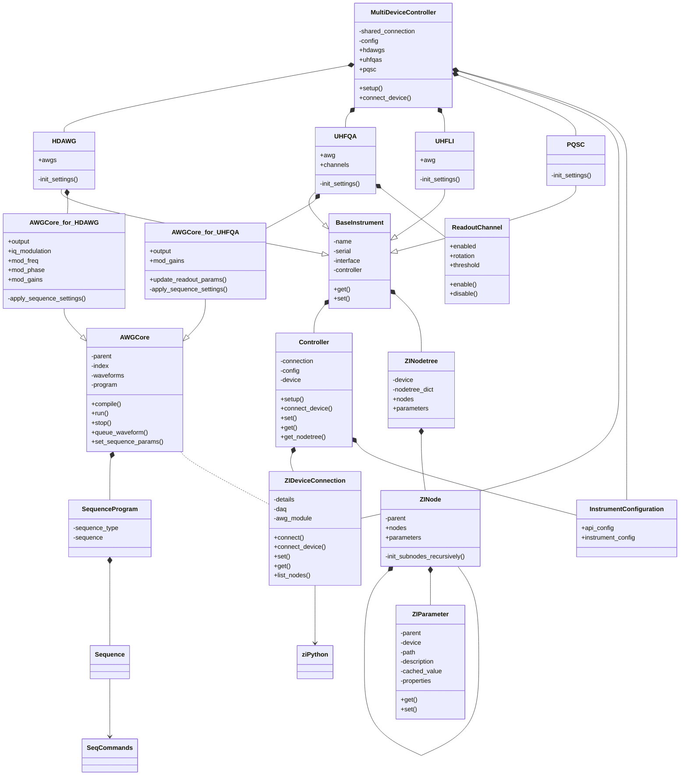

# Class Diagram

```mermaid

classDiagram
    Controller *-- ZIDeviceConnection
    ZIDeviceConnection --> ziPython
    Controller *-- InstrumentConfiguration
    AWGCore *-- SequenceProgram
    AWGCore .. ZIDeviceConnection
    SequenceProgram *-- Sequence
    Sequence --> SeqCommands
    AWGCore_for_HDAWG --|> AWGCore
    AWGCore_for_UHFQA --|> AWGCore
    HDAWG --|> BaseInstrument
    UHFQA --|> BaseInstrument
    UHFLI --|> BaseInstrument
    PQSC --|> BaseInstrument
    BaseInstrument *-- Controller
    HDAWG *-- AWGCore_for_HDAWG
    UHFQA *-- AWGCore_for_UHFQA
    UHFQA *-- ReadoutChannel
    MultiDeviceController *-- HDAWG
    MultiDeviceController *-- UHFQA
    MultiDeviceController *-- UHFLI
    MultiDeviceController *-- PQSC
    MultiDeviceController *-- ZIDeviceConnection
    MultiDeviceController *-- InstrumentConfiguration
    ZINodetree *-- ZINode
    ZINode *-- ZINode
    ZINode *-- ZIParameter
    BaseInstrument *-- ZINodetree
    
    

    
    class Controller{
        -connection
        -config
        -device
        +setup()
        +connect_device()
        +set()
        +get()
        +get_nodetree()  
    }
    class ZIDeviceConnection{
        -details
        -daq
        -awg_module
        +connect()
        +connect_device()
        +set()
        +get()
        +list_nodes()  
    }
    class InstrumentConfiguration{
        +api_config
        +instrument_config
    }
    class SequenceProgram{
        -sequence_type
        -sequence
    }
    class Sequence
    class SeqCommands
    class AWGCore{
        -parent
        -index
        -waveforms
        -program
        +compile()
        +run()
        +stop()
        +queue_waveform()
        +set_sequence_params()
    }
    class BaseInstrument{
        -name
        -serial
        -interface
        -controller
        +get()
        +set()
    }
    class HDAWG{
        +awgs
        -init_settings()
    }
    class UHFQA{
        +awg
        +channels
        -init_settings()
    }
    class UHFLI{
        +awg
        -init_settings()
    }
    class PQSC{
        -init_settings()
    }
    class ReadoutChannel{
        +enabled
        +rotation
        +threshold
        +enable()
        +disable()
    }

    class AWGCore_for_HDAWG{
        +output
        +iq_modulation
        +mod_freq
        +mod_phase
        +mod_gains
        -apply_sequence_settings()
    }
    class AWGCore_for_UHFQA{
        +output
        +mod_gains
        +update_readout_params()
        -apply_sequence_settings()
    }
    class MultiDeviceController{
        -shared_connection
        -config
        +hdawgs
        +uhfqas
        +pqsc
        +setup()
        +connect_device()
    }
    class ZINodetree{
        -device
        -nodetree_dict
        +nodes
        +parameters
    }
    class ZINode{
        -parent
        +nodes
        +parameters
        -init_subnodes_recursively()
    }
    class ZIParameter{
        -parent
        -device
        -path
        -description
        -cached_value
        -properties
        +get()
        +set()
    }

```